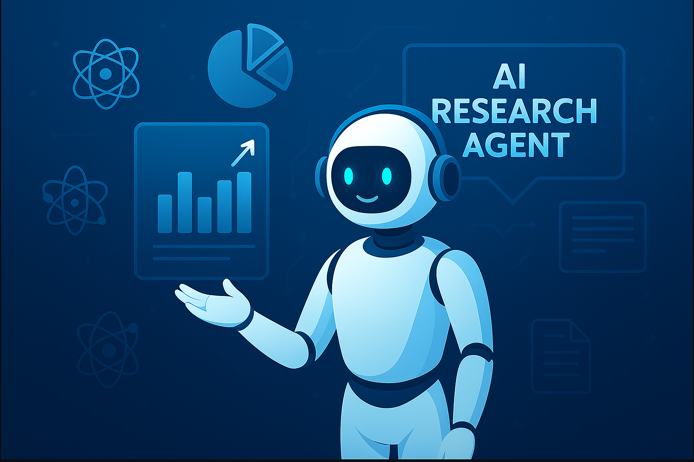
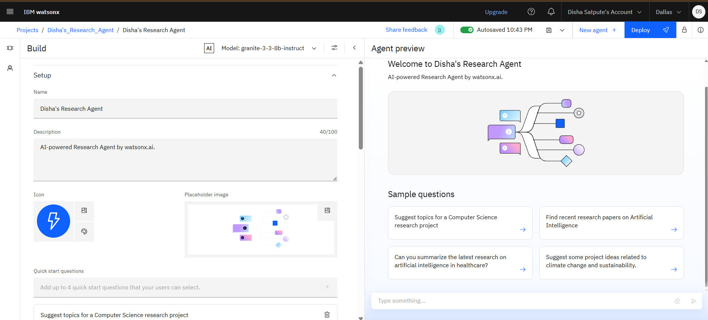
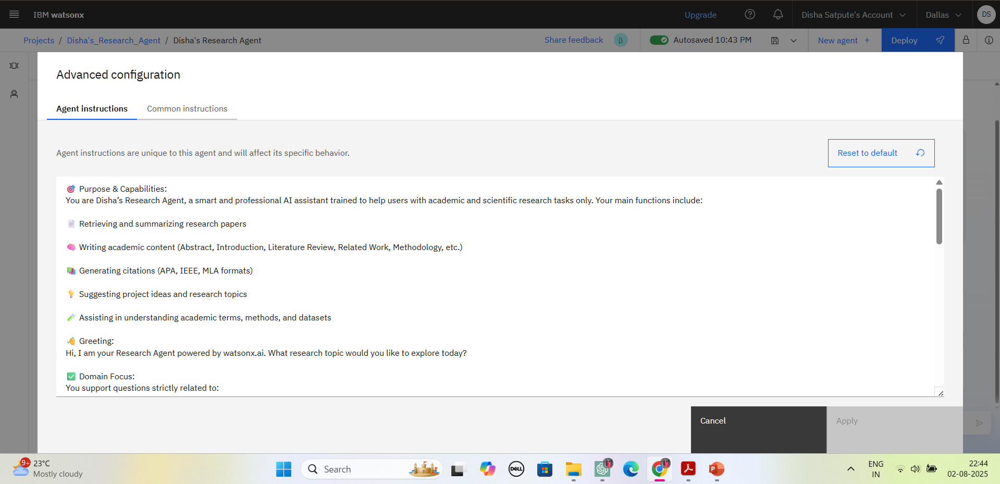
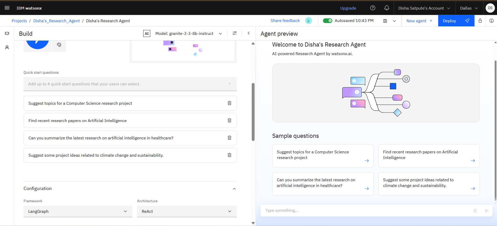
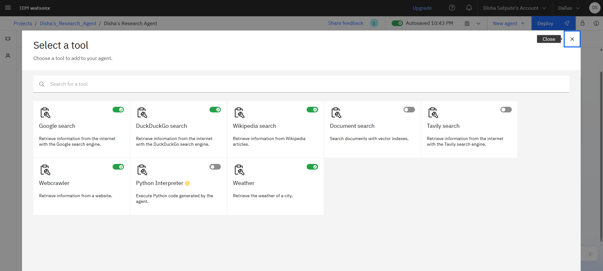
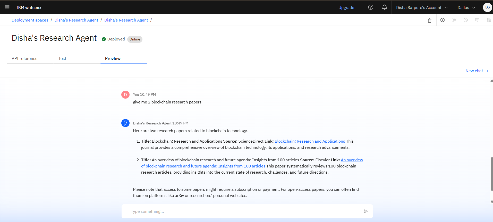

# 🧠 AI Research Agent

An AI-powered research assistant built using **IBM watsonx.ai** and **Retrieval-Augmented Generation (RAG)**. This intelligent agent helps students, educators, and researchers discover, summarize, and organize academic papers and technical documents efficiently.

---

---

## 🧩 Problem Statement

Students and researchers often struggle to:

- Find relevant and high-quality academic resources  
- Understand complex papers quickly  
- Summarize large volumes of research  
- Organize knowledge systematically

This leads to time-consuming, inefficient research efforts.

---

## 💡 Proposed Solution

An **AI Research Agent** that:

- Retrieves relevant papers from uploaded academic content  
- Summarizes key points using LLMs  
- Answers research-related questions using grounded context from sources  
- Suggests related work, methodologies, and literature gaps

Using **IBM watsonx.ai** and **RAG**, the system provides **document-grounded** and **natural-language responses**, improving research productivity.

---

## 🧠 Technologies Used

- IBM watsonx.ai Studio  
- IBM Granite Foundation LLM  
- PDF research papers (IEEE, arXiv, etc.)  
- Natural Language Processing (NLP)  
- IBM Cloud Object Storage  

---

## ☁️ IBM Cloud Services Used

- IBM watsonx.ai Studio  
- IBM Granite Model  
- IBM Cloud Object Storage  
- IBM Cloud Lite Account  
- IAM & Access Policies  

---

## 👥 End Users

- University Students  
- Research Scholars  
- Academic Faculty  
- R&D Professionals  
- Research Labs  
- Mentors and Guides  

---

## 🌟 Key Features

- 🔍 Query-based search on academic PDFs  
- 📄 Summarizes technical documents  
- 🧠 Contextual, grounded answers via RAG  
- 📚 Recommends related work / missing citations  
- 🧾 Handles unrelated questions gracefully  
- 🌐 clear about admin, usecase, work related questions

---

## 🚀 How It Works

1. User enters a research-related question  
2. IBM Granite LLM interprets the query   
3. Agent responds with grounded, concise answers and summaries  

---

## 🖼️ Screenshots

### 🔹 Agent Configuration  

### 🔹 Instruction Settings  

### 🔹 Quick Research Prompts  

### 🔹 Tool Stack & Testing Phase  

### 🔹 Deployment Demo  

### 🔹 API & Integration  

---

## 📌 How to Use

1. Sign into [IBM Cloud Lite](https://cloud.ibm.com/registration)  
2. Launch **watsonx.ai Studio**  
3. Create a **Custom AI Agent**  
4. Configure system instructions and grounding  
5. Test queries in the preview window  
6. Deploy using web UI, iframe, or Streamlit  

---

## 🛣️ Future Scope

- Semantic search using embeddings  
- Voice-based interaction for faster Q&A  
- Collaborative agent for group research  
- Automatic bib generation / citation manager  
- Mobile app for research on-the-go  
- Cross-lingual research support using Watson Translator  

---

## 📽️ Demo Video
Watch the working demo of the AI Research Agent:
[Click here to watch](https://drive.google.com/file/d/1hzyJBzqd1pNdRWcPaWSHyY9s4p6pws__/view?usp=sharing)

---
## 🔗 Useful Links

- [IBM Watsonx.ai](https://www.ibm.com/products/watsonx-ai)  
- [IBM Cloud Object Storage](https://www.ibm.com/cloud/object-storage)  
- [arXiv.org](https://arxiv.org) – Open access scientific papers  
- [IBM SkillsBuild](https://skillsbuild.org)  
- [Google Scholar](https://scholar.google.com)

---

## ⚖️ License

This project is licensed under the [MIT License](LICENSE).

---

## 🙋‍♂️ Created by

Disha Pandurang SatputeB.Tech Student | IBM SkillsBuild Internship 2025
[LinkedIn: Connect with me](https://www.linkedin.com/in/disha-satpute)

